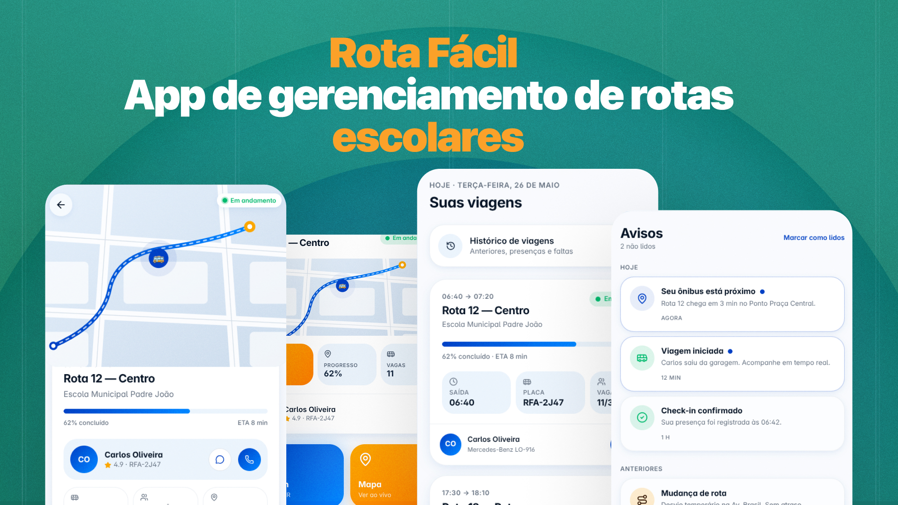

# Rota Fácil - Plataforma de gerenciamento inteligente para transporte escolar municipal

 

O Rota Fácil é uma solução desenvolvida para modernizar e centralizar o gerenciamento do transporte escolar municipal, permitindo que prefeituras, motoristas e estudantes acompanhem rotas, viagens e informações importantes em tempo real. O sistema foi pensado para reduzir falhas de comunicação, aumentar a visibilidade das operações e oferecer uma experiência mais organizada para todos os participantes envolvidos no transporte escolar.

O aplicativo mobile desenvolvido em React Native representa uma das principais interfaces da plataforma, permitindo que estudantes acompanhem viagens, realizem check-in via QR Code e visualizem informações relacionadas às rotas, enquanto motoristas conseguem acompanhar viagens do dia, acessar listas de alunos e executar operações relacionadas ao transporte diretamente pelo dispositivo móvel.

A solução faz parte de uma arquitetura distribuída baseada em microserviços, utilizando mensageria com RabbitMQ, banco de dados PostgreSQL e serviços independentes containerizados com Docker, permitindo escalabilidade, desacoplamento e maior confiabilidade na comunicação entre os componentes do sistema. 

A documentação do projeto foi organizada em arquivos separados para facilitar manutenção, leitura e evolução da aplicação ao longo do desenvolvimento.

📌 [Como contribuir](./docs/CONTRIBUTING.md)   
📌 [Estrutura do projeto](./docs/PROJECT_STRUCTURE.md)   
📌 [Como executar o projeto](./docs/RUNNING.md)   
📌 [Principais telas do aplicativo](./docs/SCREENS.md)  

 

### Licença

Este projeto está sob a licença MIT.