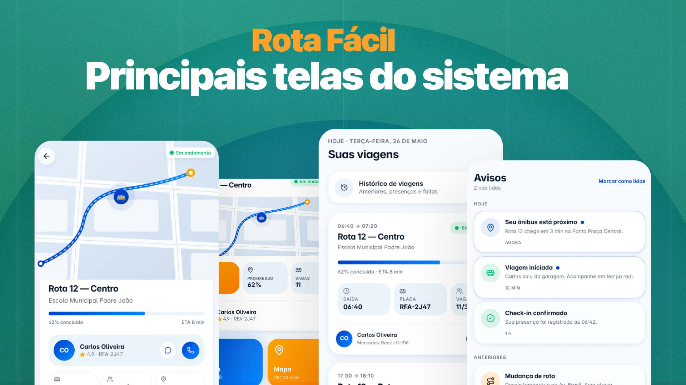

# Principais telas do sistema 

## Design e Prototipação

O design do **Rota Fácil** foi concebido com uma abordagem mobile-first, priorizando uma experiência fluida, acessível e eficiente para usuários que dependem do smartphone durante o uso diário do transporte escolar. Toda a interface do aplicativo foi planejada considerando cenários reais de utilização, como acompanhamento de viagens em tempo real, acesso rápido às rotas, check-in via QR Code e comunicação entre estudantes, motoristas e gestão municipal.

Diferente de sistemas tradicionais adaptados posteriormente para dispositivos móveis, o aplicativo nasce com foco total em mobilidade, simplicidade de navegação e clareza das informações. A experiência visual busca reduzir complexidade operacional e tornar o fluxo de uso intuitivo mesmo em contextos de baixa conectividade ou uso rápido durante deslocamentos.

O processo de prototipação foi desenvolvido no Figma, permitindo validação antecipada de fluxos, componentes visuais e experiência do usuário antes da implementação das funcionalidades da aplicação.

**Figma:** [Acessar Protótipo](https://www.figma.com/)

 

## Algumas telas do sistema: 

 

Navegue pela documentação : 

📌 [Overview](../README.md)   
📌 [Como contribuir](./CONTRIBUTING.md)   
📌 [Estrutura do projeto](./PROJECT_STRUCTURE.md)   
📌 [Como executar o projeto](./RUNNING.md)   
📌 [Geração de Development Build com EAS](./EAS_BUILD.md)